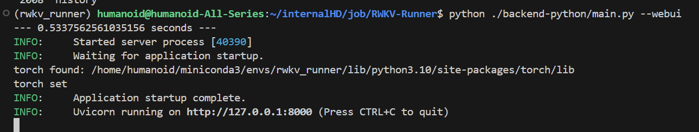
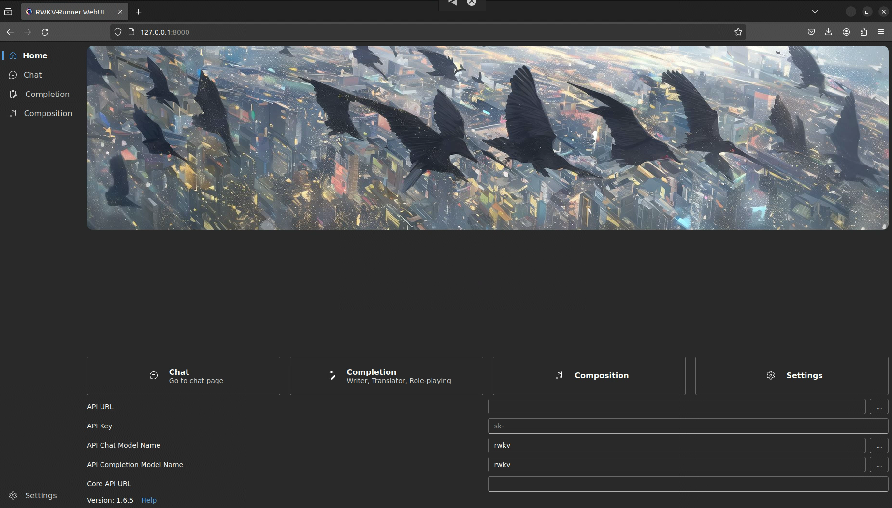

# RWKV Language Model Setup and Usage Guide  for Local Computer.

These days, Large Language Models (LLMs) are becoming increasingly popular. While you can use free APIs, they are quite restricted, and training one with trillions of tokens is not affordable for most individuals. This repository leverages RWKV (pronounced RwaKuv), an RNN with GPT-level LLM performance, which is notably beneficial due to the smallest open-source model being around 200MB. This size makes it feasible for CPU inference on a laptop.

RWKV also includes a built-in lightweight UI for an easy-to-use experience similar to ChatGPT, and it supports multimodality. Check out the repository here: [RWKV runner](https://github.com/josStorer/RWKV-Runner?tab=readme-ov-file).

## Environmental Setup

**Note:** Before installing packages, it's crucial to install the Nvidia CUDA Toolkit 11.7. Without this specific version, you may encounter compilation errors later.

I prefer using conda environments for their sandboxed nature. Here are the steps to create and activate a conda environment:

```bash
conda create -n rwkv_env python==3.10
conda activate rwkv_env
pip install torch==1.13.1+cu117 --extra-index-url https://download.pytorch.org/whl/cu117
pip install pytorch-lightning==1.9.5 deepspeed==0.7.0 wandb ninja
```

## Custom Dataset Preparation

The trainer expects the data to be in alpaca format:

```json
[
    {
        "instruction": "Identify the idiom in the given sentence and provide its meaning.",
        "input": "Despite the challenges, he decided to take the bull by the horns and actively pursue job opportunities.",
        "output": "To confront a problem or challenge directly and with determination."
    },
]
```

Now, convert the dataset using the provided script:

```bash
python convert_dataset input_file.json output_file.txt
```

## Training

For training, we will use [RWKV-LM-LoRA](https://github.com/Blealtan/RWKV-LM-LoRA), which can train a model using the LoRA technique, requiring much less memory. First, clone the repository:

```bash
mkdir mycustom_llm
cd mycustom_llm
git clone https://github.com/Blealtan/RWKV-LM-LoRA.git
```

To use a Python script for downloading, install huggingface first:

```bash
# Inside your conda environment
python -m pip install huggingface huggingface_hub
```

Download the lightweight RWKV-v4neo model from Hugging Face:

```python
from huggingface_hub import snapshot_download
REPO_ID = "BlinkDL/rwkv-4-pile-169m"
FILENAME = "RWKV-4-Pile-169M-20220807-8023.pth"
snapshot_download(repo_id=REPO_ID, local_dir="the folder where to save")
```

Or, use git-lfs:

```bash
git lfs install
git clone https://huggingface.co/BlinkDL/rwkv-4-pile-169m
```

Once downloaded we can start training our model on the custom dataset. Remember to be inside your conda environment that we created earler ```rwkv_env```. Now navigate to the `RWKV-LM-LoRA` directory. For me its `\home\User\mycustom_llm/RWKV-LM-LoRA`.

```bash
cd ./RWKV-LM-LoRA/RWKV-v4neo/
```
Before we start the training process we need to configure some variables.

`--load_model`: downloaded model path from huggingface. you need to provide the file path with the name `RWKV-4-Pile-169M-20220807-8023.pth` \
`--proj_dir`: where the training checkpoints will be saved. \
`--data_file`: the dataset file. \
`--data_type`: `numpy` \
`--accelerator`: `cpu` or `cuda`. if you dont have a gpu then you can uses the cpu option else cuda option \
You can keep the others as it is or tune them for performance

```bash
python train.py --load_model "/home/humanoid/internalHD/job/custom/hf_rwkv_weights/RWKV-4-Pile-169M-20220807-8023.pth" --proj_dir "checkpoint_dir" --data_file "/home/humanoid/internalHD/job/custom/training/dataset/train.npy" --data_type "numpy" --vocab_size 50277 --ctx_len 384 --epoch_steps 100 --epoch_count 100 --epoch_begin 0 --epoch_save 5 --micro_bsz 2 --accumulate_grad_batches 4 --n_layer 12 --n_embd 768 --pre_ffn 0 --head_qk 0 --lr_init 1e-4 --lr_final 1e-4 --warmup_steps 0 --beta1 0.9 --beta2 0.999 --adam_eps 1e-8 --accelerator gpu --devices 1 --precision 'fp16' --strategy deepspeed_stage_2 --grad_cp 0 --lora --lora_r 8 --lora_alpha 16 --lora_dropout 0.01 --lora_parts=att,ffn,time,ln
```

Once the training is finished we need to convert it back to the original weights in huggingface_format. The script is already provided in the repo. To merge the weights run the following command inside `RWKV-v4neo` directory.
`python3 merge_lora.py --use-gpu 8 <base_model.pth> <lora_checkpoint.pth> <output.pth>`

## Inference
**NOTE:** IF you dont have a custom trained model then you can just change the weights to use it.\
For inference on either a Windows or Linux machine, repeat the environment setup if it's a different machine from where training was performed. Use the RWKV_runner for inference. First, download and install necessary components:

```bash
# Enter into our mycustom_llm directory
cd ./mycustom_llm
git clone https://github.com/josStorer/RWKV-Runner
conda activate rwkv_env
python3 -m pip install -r RWKV-Runner/backend-python/requirements.txt
```

For the front-end chat interface, install npm following the instructions [here](https://docs.npmjs.com/downloading-and-installing-node-js-and-npm/). Then, build the interface:

```bash
cd RWKV-Runner/frontend
npm ci
npm run build
cd ..
python ./backend-python/main.py --webui
```
You will see the following message.

Now if you go to the link `http://127.0.0.1:8000` on your browser you will see a chat interface.

Load your custom model with the following command:

```bash
curl http://127.0.0.1:8000/switch-model -X POST -H "Content-Type: application/json" -d '{"model":"the path to output.pth","strategy":"cuda fp16"}
```
If you want to use CPU then change `cuda` to `cpu` also you can modify the `fp16` to any precision of your choice.

Now, everything is set up. Enjoy your chat with the model!


